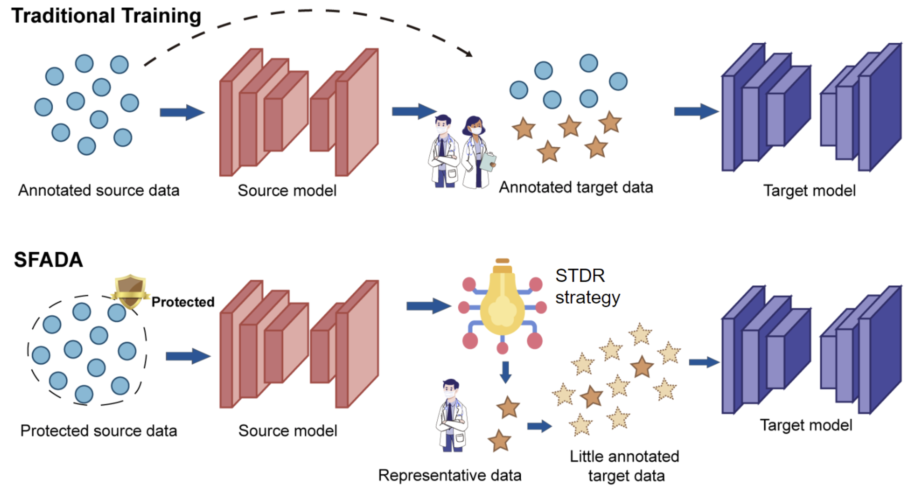

# Dual-Reference Source-Free Active Domain Adaptation for Nasopharyngeal Carcinoma Tumor Segmentation across Multiple Hospitals 🏥

We are excited to announce that our paper was accepted for publication at **IEEE TMI 2024**! 🥳🥳🥳

This repository contains the official implementation of our paper. 
You can access the paper [here](https://ieeexplore.ieee.org/abstract/document/10553522).

## Introduction 📑

This project introduces a new setting in medical image segmentation, termed Source-Free Active Domain Adaptation (SFADA). SFADA aims to facilitate cross-center medical image segmentation while protecting data privacy and reducing the workload on medical professionals. By requiring only minimal labeling effort, SFADA achieves effective model transfer and results comparable to those of fully supervised approaches.

To add an image to this README, you can upload the image to your GitHub repository and then use the following Markdown syntax to include it:
```markdown

